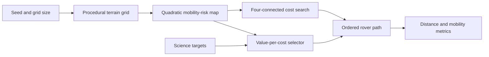
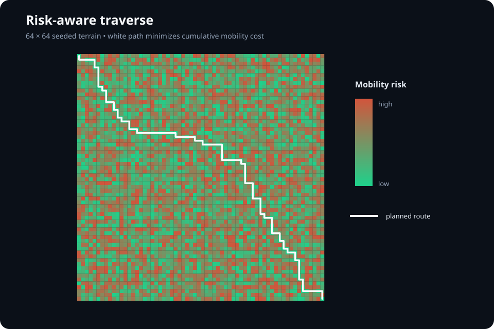
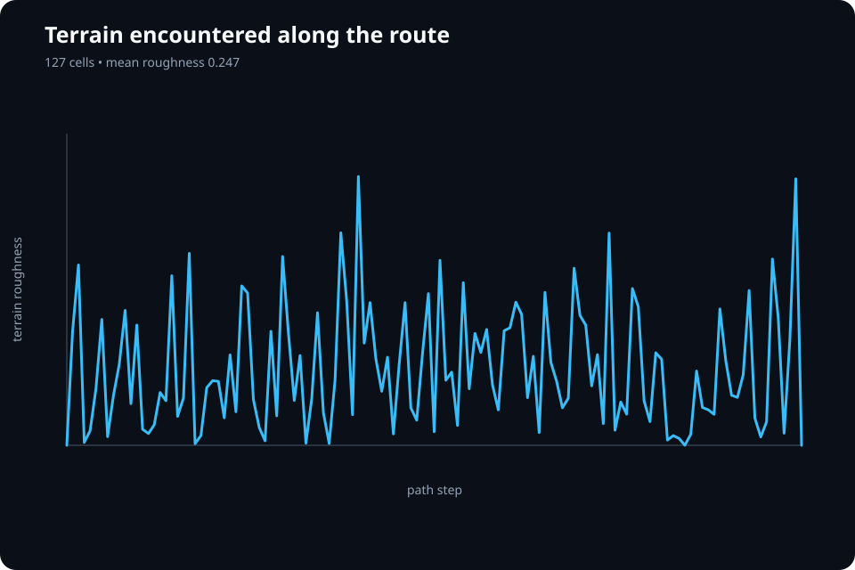

# planetary-autonomy-sim

A deterministic autonomous-rover simulation MVP. It procedurally creates a Martian terrain grid, evaluates mobility risk, plans with Dijkstra-style cost search, then re-routes toward high-value science targets when safe.

## Why this project exists

Planetary rovers must reason about safety, energy, and scientific value without continuous human control. This repository provides a reproducible baseline for studying that tradeoff: terrain is generated from a seed, every cell receives a mobility cost, and the planner selects a minimum-cost traverse through the map.

The implementation is intentionally dependency-light so new perception, terramechanics, SLAM, and control methods can be measured against a stable reference before moving into a full physics simulator.

## Architecture



## Quick start

```bash
python -m venv .venv
source .venv/bin/activate
python -m pip install -e ".[dev]"
python -m planetary_autonomy_sim.sim --size 32 --seed 5
python -m planetary_autonomy_sim.report --size 64 --seed 5
pytest
```

On Windows PowerShell, activate the environment with `.venv\Scripts\Activate.ps1`.

### Command-line options

| Option | Default | Purpose |
| --- | ---: | --- |
| `--size` | `32` | Width and height of the square terrain grid |
| `--seed` | `0` | Seed controlling the procedural roughness field |

Example output from the verified run:

```text
{'distance_m': 3.1, 'cells': 63, 'mobility_cost': 187.77}
```

## MVP snapshot

| Metric | Verified demo result |
| --- | ---: |
| Procedural terrain grid | 32 x 32 (1,024 cells) |
| Traverse path | 63 cells |
| Simulated traverse distance | 3.10 m at 5 cm/cell |
| Aggregate mobility cost | 187.77 |
| Reproducibility | deterministic with `--seed 5` |

These values come from `python -m planetary_autonomy_sim.sim --size 32 --seed 5`. The baseline plans a lowest-cost route across the generated terrain; it is a deliberately compact stand-in for the planned D*-Lite and MPPI stack.

## Reproducible benchmark results

The committed benchmark is an actual run of the planner on a `64 × 64` seeded terrain containing `4,096` cells. The optimized route spans `127` cells (`6.30 m`) with a cumulative mobility cost of `376.458`. Compared with the fixed edge-route baseline, the planner reduced cost by `63.12%`. Mean roughness along the chosen route was `0.2466`, versus `0.5005` across the complete terrain.





The complete benchmark is inspectable rather than baked into an opaque image:

- [`terrain.csv`](results/demo/terrain.csv): all 4,096 cells, roughness values, costs, and route membership
- [`route.csv`](results/demo/route.csv): ordered 127-cell traverse with local risk values
- [`summary.json`](results/demo/summary.json): benchmark settings and computed performance metrics

Regenerate every artifact with:

```bash
python -m planetary_autonomy_sim.report --size 64 --seed 5 --output results/demo
```

## What is implemented today

| Layer | MVP implementation | Next research integration |
| --- | --- | --- |
| Terrain | seeded 0–1 roughness grid with 5 cm cells | crater, dune, and rock-field priors |
| Mobility | quadratic terrain-risk cost | slope, step, cohesion, and Bekker–Wong terms |
| Planning | deterministic Dijkstra-style lowest-cost route | incremental D*-Lite + local MPPI |
| Science | value-per-travel-cost target selector | spectral/textural anomaly detection |

The current simulation favors clear, repeatable behavior over photorealism so that future perception, SLAM, and dynamics benchmarks have a stable baseline.

## Planner and terrain model

Every terrain cell has a seeded roughness value `r` in `[0, 1]`. The baseline converts roughness into traversal cost using:

```text
cell_cost = 1 + 20 × r²
```

The planner explores four-connected neighbors with a priority queue and reconstructs the lowest-cost route from the goal back to the start. Distance assumes a `5 cm` cell resolution. The separate science selector ranks reachable targets by `science_value / travel_cost`, providing the extension point for autonomous science-driven detours.

## Module guide

| Module | Responsibility |
| --- | --- |
| `terrain.py` | Seeded roughness generation and traversability cost |
| `planner.py` | Priority-queue cost search and route reconstruction |
| `science.py` | Science target representation and value-per-cost selection |
| `sim.py` | End-to-end traverse, CLI parsing, and summary metrics |
| `report.py` | Terrain/route export, benchmark metrics, and SVG visualization |
| `tests/test_sim.py` | Seed reproducibility, path existence, and positive-cost checks |

## Validation and reproducibility

```bash
python -m planetary_autonomy_sim.sim --size 32 --seed 5
python -m planetary_autonomy_sim.report --size 64 --seed 5
python -m compileall -q src
pytest
```

`tests/test_sim.py` verifies repeatability for a seeded 16 x 16 traverse and confirms the planner returns a non-empty route with positive mobility cost. GitHub Actions runs the same test suite for every push and pull request.

## Current limitations

- Terrain currently models scalar roughness rather than elevation, slope, rocks, dunes, or soil classes.
- Planning is global and static; it does not yet replan as terrain is revealed.
- The rover is a point on a grid without steering, suspension, slip, energy, or tip-over dynamics.
- The science selector exists as a reusable layer but is not yet connected to the CLI traverse.
- Camera rendering, stereo reconstruction, SLAM, and orbital tie-points remain roadmap components.

## Roadmap

1. Generate elevation-aware crater, dune, and rock-field terrain.
2. Add rover geometry and Bekker–Wong wheel-soil interaction.
3. Implement incremental D*-Lite replanning and local MPPI control.
4. Integrate simulated stereo perception and pose-graph SLAM.
5. Compare safety, path cost, and runtime against A* and RRT* baselines.

## Repository layout

- `src/planetary_autonomy_sim/`: terrain, planning, science, and simulation code
- `envs/`: reserved terrain scenarios and map assets
- `configs/`: reserved rover and experiment configurations
- `benchmarks/`: reserved comparative performance results
- `notebooks/`: reserved walkthroughs and visual analysis
- `tests/`: deterministic regression tests

The source layout keeps clear extension points for Open3D/PyBullet rendering, stereo perception, GTSAM SLAM, D*-Lite/MPPI control, and a Bekker–Wong terramechanics model.
